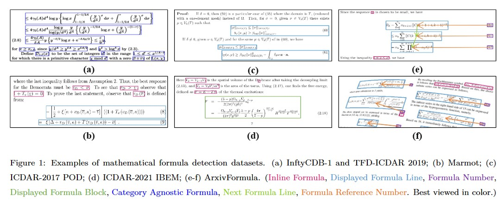
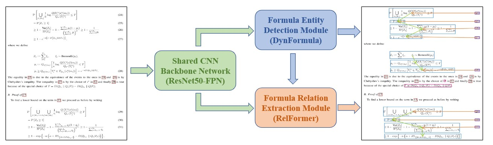

# ArxivFormula

ArxivFormula is the first dataset framing mathematical formula detection as a joint task of formula entity detection and formula relation extraction, rather than a simple task of object detection or instance segmentation. It's constructed using a weak supervision approach and comprises 500K document images for training, 50K for validation and 50K for testing.

## News
- **We released annotations and origin document images of the ArxivFormula datasets ([OneDrive](https://1drv.ms/f/s!AvjKgA816xGJpEC_t684KIkfDMfm?e=6d9PjF)), please refer to `Get Data` section.**
- **We released some examples of the ArxivFormula datasets, please refer to `ArxivFormula_examples.zip`.**

## Introduction 
Most of existing mathematical formula detectors focus on detecting formula entities through object detection or instance segmentation techniques. However, these methods often fail to convey complete messages due to the absence of the contextual and layout information of mathematical formulas. For a more comprehensive understanding of mathematical formulas in document images, it is preferable to detect logical formula blocks that include one or multiple formula entities arranged in their natural reading order. These logical formula blocks enable the transmission of complete contextual messages of mathematical formulas and aid in the reconstruction of layout information of the document images, resulting in a more accurate mathematical formula detection. To this end, ArxivFormula first presents a novel perspective on the problem of mathematical formula detection by framing it as a joint task of formula entity detection and formula relation extraction, rather than a simple task of object detection or instance segmentation. This new perspective enables us to detect logical formula blocks that convey complete contextual and layout information of mathematical formulas, while also eliminating labeling issues in existing benchmark datasets.

### Comparisons among ArxivFormula and existing mathematical formula detection datasets.
<table>  
    <thead>  
        <tr>  
            <th rowspan="2" style="text-align:center">Dataset</th>  
            <th rowspan="2" style="text-align:center">#Documents</th>  
            <th rowspan="2" style="text-align:center">#Images</th>  
            <th colspan="4" style="text-align:center">Formula Entity</th>  
            <th colspan="2" style="text-align:center">Formula Relation</th>  
        </tr>  
        <tr>  
            <th style="text-align:center">IF</th>  
            <th style="text-align:center">DFL</th>  
            <th style="text-align:center">DFB</th>  
            <th style="text-align:center">FN</th>  
            <th style="text-align:center">NFL</th>  
            <th style="text-align:center">FRN</th>  
        </tr>  
    </thead>  
    <tbody>  
        <tr>  
            <td style="text-align:center">InftyCDB-1</td>  
            <td style="text-align:center">30</td>  
            <td style="text-align:center">467</td>  
            <td colspan="2" style="text-align:center">21k</td>  
            <td style="text-align:center">-</td>  
            <td style="text-align:center">-</td>  
            <td style="text-align:center">-</td>  
            <td style="text-align:center">-</td>  
        </tr>  
        <tr>  
            <td style="text-align:center">Marmot</td>  
            <td style="text-align:center">194</td>  
            <td style="text-align:center">400</td>  
            <td style="text-align:center">7.9k</td>  
            <td style="text-align:center">1.6k</td>  
            <td style="text-align:center">-</td>  
            <td style="text-align:center">-</td>  
            <td style="text-align:center">-</td>  
            <td style="text-align:center">-</td>  
        </tr>  
        <tr>  
            <td style="text-align:center">ICDAR-2017 POD</td>  
            <td style="text-align:center">1.5k</td>  
            <td style="text-align:center">2.4k</td>  
            <td style="text-align:center">-</td>  
            <td style="text-align:center">5.4k</td>  
            <td style="text-align:center">-</td>  
            <td style="text-align:center">-</td>  
            <td style="text-align:center">-</td>  
            <td style="text-align:center">-</td>  
        </tr>  
        <tr>  
            <td style="text-align:center">TFD-ICDAR 2019</td>  
            <td style="text-align:center">46</td>  
            <td style="text-align:center">805</td>  
            <td colspan="2" style="text-align:center">38k</td>  
            <td style="text-align:center">-</td>  
            <td style="text-align:center">-</td>  
            <td style="text-align:center">-</td>  
            <td style="text-align:center">-</td>  
        </tr>  
        <tr>  
            <td style="text-align:center">ICDAR-2021 IBEM</td>  
            <td style="text-align:center">600</td>
            <td style="text-align:center">8.3k</td>
            <td style="text-align:center">137k</td>
            <td style="text-align:center">-</td>
            <td style="text-align:center">29k</td>
            <td style="text-align:center">-</td>
            <td style="text-align:center">-</td>
            <td style="text-align:center">-</td>
        </tr>
        <tr>
            <td style="text-align:center"><strong>ArxivFormula</strong></td>
            <td style="text-align:center"><strong>100k</strong></td>
            <td style="text-align:center"><strong>600k</strong></td>
            <td style="text-align:center"><strong>15M</strong></td>
            <td style="text-align:center"><strong>1.9M</strong></td>
            <td style="text-align:center"><strong>1.4M</strong></td>
            <td style="text-align:center"><strong>795k</strong></td>
            <td style="text-align:center"><strong>540k</strong></td>
            <td style="text-align:center"><strong>795k</strong></td>
        </tr>
    </tbody>
</table>

Note: (IF: Inline Formula, DFL: Displayed Formula Line, DFB: Displayed Formula Block, FN: Formula Number, NFL: Next Formula Line, FRN: Formula Reference Number.)

### **Get Data**
**\*\*Please DO NOT re-distribute the dataset.\*\***

The annotations and original document images of the ArxivFormula dataset can be download from the [OneDrive](https://1drv.ms/f/s!AvjKgA816xGJpEC_t684KIkfDMfm?e=6d9PjF). In order to reduce the loss caused by download interruption, we divided "ArxivFormula_Training_set_images.zip" into 10 parts, and after downloading all of them, use the decompression software to decompress them together. Additionally, we would like to note that we have only released the document images and annotations of arXiv papers that comply with the [arXiv.org perpetual, non-exclusive license](https://arxiv.org/licenses/nonexclusive-distrib/1.0/license.html). This constitutes approximately 93% of the entire dataset.

| File | Size | md5sum |
| :-: | :-: | :-: |
| ArxivFormula_Training_set_images.zip   [[1], [2], [3], [4], [5], [6], [7], [8], [9], [10]] | 5.9 GB   /each part | - |
| ArxivFormula_Validation_set_images.zip | 5.9 GB | a0f944b4150940c1d3cf060ff4307d7f |
| ArxivFormula_Testing_set_images.zip |5.9 GB | fc3b956bbbe5a20ae82e74b4a182951e |
| ArxivFormula_Annotations.zip | 1.1 GB | a5735ae789850a854b0326079e3c925f  |

 The annotation format used is the standard COCO-style annotation format. More details about the dataset please refer to [ArxivFormula_Details](./ArxivFormula_Details.md).

### FormulaDet
We propose a new approach, called FormulaDet, to address these two sub-tasks simultaneously. FormulaDet first employs a dynamic convolution-based formula entity detector, named DynFormula, to detect formula entities. It then uses a multi-modal transformer-based relation extraction method, named RelFormer, to group these detected formula entities into logical formula blocks.

## Results

### Formula Entity Segmentation
<table>  
    <thead>  
        <tr>  
            <th rowspan="2"></th>  
            <th rowspan="2">Methods</th>  
            <th colspan="4">Validation Set (%)</th>  
            <th colspan="4">Testing Set (%)</th>  
        </tr>  
        <tr>  
            <th>IF</th>  
            <th>DFL</th>  
            <th>FN</th>  
            <th>Avg.</th>  
            <th>IF</th>  
            <th>DFL</th>  
            <th>FN</th>  
            <th>Avg.</th>  
        </tr>  
    </thead>  
    <tbody>  
        <tr>  
            <td rowspan="2">Detection</td>  
            <td>Faster R-CNN</td>  
            <td>84.2</td>  
            <td>92.9</td>  
            <td>98.6</td>  
            <td>91.9</td>  
            <td>83.9</td>  
            <td>92.9</td>  
            <td>98.7</td>  
            <td>91.8</td>  
        </tr>  
        <tr>  
            <td>Oriented R-CNN</td>  
            <td>85.3</td>  
            <td>93.4</td>  
            <td>98.8</td>  
            <td>92.5</td>  
            <td>85.0</td>  
            <td>93.5</td>  
            <td>98.9</td>  
            <td>92.5</td>  
        </tr>  
        <tr>  
            <td rowspan="4">Segmentation</td>  
            <td>Mask R-CNN</td>  
            <td>87.0</td>  
            <td>93.5</td>  
            <td>98.8</td>  
            <td>93.1</td>  
            <td>86.8</td>  
            <td>93.9</td>  
            <td>99.0</td>  
            <td>93.2</td>  
        </tr>  
        <tr>  
            <td>Vanilla CondInst</td>  
            <td>56.8</td>  
            <td>95.4</td>  
            <td>75.9</td>  
            <td>76.0</td>  
            <td>56.6</td>  
            <td>95.4</td>  
            <td>75.9</td>  
            <td>76.0</td>  
        </tr>  
        <tr>  
            <td>Mask2Former</td>  
            <td>60.7</td>  
            <td>95.9</td>  
            <td>97.1</td>  
            <td>84.6</td>  
            <td>60.4</td>  
            <td>95.9</td>  
            <td>97.1</td>  
            <td>84.5</td>  
        </tr>  
        <tr>  
            <td><strong>DynFormula</strong></td>  
            <td><strong>89.5</strong></td>  
            <td><strong>96.0</strong></td>  
            <td><strong>99.2</strong></td>  
            <td><strong>94.9</strong></td>  
            <td><strong>89.3</strong></td>  
            <td><strong>95.9</strong></td>  
            <td><strong>99.4</strong></td>
<td><strong>94.9</strong></td>
</tr>
</tbody>

</table>

### Formula Relation Extraction

<table>  
    <thead>  
        <tr>  
            <th rowspan="2">Dataset</th>  
            <th rowspan="2">Methods</th>  
            <th colspan="3">NFL (%)</th>  
            <th colspan="3">FRN (%)</th>  
            <th rowspan="2">Avg. F1 (%)</th>  
        </tr>  
        <tr>  
            <th>P</th>  
            <th>R</th>  
            <th>F1</th>  
            <th>P</th>  
            <th>R</th>  
            <th>F1</th>  
        </tr>  
    </thead>  
    <tbody>  
        <tr>  
            <td rowspan="4">Val</td>  
            <td>X-Y Cut</td>  
            <td>80.21</td>  
            <td>71.24</td>  
            <td>75.46</td>  
            <td>77.65</td>  
            <td>77.65</td>  
            <td>77.65</td>  
            <td>76.6</td>  
        </tr>  
        <tr>  
            <td>Relation Network</td>  
            <td>93.85</td>  
            <td>89.28</td>  
            <td>91.51</td>  
            <td>92.45</td>  
            <td>96.41</td>  
            <td>94.39</td>  
            <td>93.0</td>  
        </tr>  
        <tr>  
            <td>GCN</td>  
            <td>94.44</td>  
            <td>90.34</td>  
            <td>92.34</td>  
            <td>95.02</td>  
            <td>95.31</td>  
            <td>95.16</td>  
            <td>93.8</td>  
        </tr>  
        <tr>  
            <td><strong>RelFormer</strong></td>  
            <td><strong>94.84</strong></td>  
            <td><strong>92.52</strong></td>  
            <td><strong>93.67</strong></td>  
            <td><strong>95.81</strong></td>  
            <td><strong>96.78</strong></td>  
            <td><strong>96.29</strong></td>  
            <td><strong>95.0</strong></td>  
        </tr>  
        <tr>  
            <td rowspan="4">Test</td>  
            <td>X-Y Cut</td>  
            <td>79.84</td>  
            <td>72.65</td>  
            <td>76.08</td>  
            <td>77.25</td>  
            <td>77.25</td>  
            <td>77.25</td>  
            <td>76.7</td>  
        </tr>  
        <tr>  
            <td>Relation Network</td>  
            <td>94.03</td>  
            <td>89.61</td>  
            <td>91.77</td>  
            <td>92.54</td>  
            <td>96.15</td>  
            <td>94.31</td>  
            <td>93.0</td>  
        </tr>  
        <tr>  
            <td>GCN</td>  
            <td>94.59</td>  
            <td>91.60</td>  
            <td>93.07</td>  
            <td>95.21</td>  
            <td>95.19</td>
            <td>95.20</td>
            <td>94.1</td>
        </tr>
        <tr>
            <td><strong>RelFormer</strong></td>
            <td><strong>94.45</strong></td>
            <td><strong>92.31</strong></td>
            <td><strong>93.37</strong></td>
            <td><strong>96.37</strong></td>
            <td><strong>96.19</strong></td>
            <td><strong>96.28</strong></td>
            <td><strong>94.8</strong></td>
        </tr>
    </tbody>
</table>

### End-to-End Evaltion
<table>  
    <thead>  
        <tr>  
            <th rowspan="2">Dataset</th>  
            <th rowspan="2">Methods</th>  
            <th colspan="3">IoU=0.7 (%)</th>  
            <th colspan="3">IoU=0.8 (%)</th>  
            <th colspan="3">IoU=0.9 (%)</th>  
            <th rowspan="2">Avg. F1 (%)</th>  
        </tr>  
        <tr>  
            <th>P</th>  
            <th>R</th>  
            <th>F1</th>  
            <th>P</th>  
            <th>R</th>  
            <th>F1</th>  
            <th>P</th>  
            <th>R</th>  
            <th>F1</th>  
        </tr>  
    </thead>  
    <tbody>  
        <tr>  
            <td rowspan="3">Val</td>  
            <td>Mask R-CNN</td>  
            <td>94.1</td>  
            <td>94.1</td>  
            <td>94.1</td>  
            <td>87.5</td>  
            <td>87.5</td>  
            <td>87.5</td>  
            <td>62.2</td>  
            <td>62.4</td>  
            <td>62.3</td>  
            <td>81.3</td>  
        </tr>  
        <tr>  
            <td>DynFormula</td>  
            <td>94.3</td>  
            <td>94.7</td>  
            <td>94.5</td>  
            <td>88.1</td>  
            <td>90.0</td>  
            <td>89.0</td>  
            <td>68.3</td>  
            <td>70.7</td>  
            <td>69.5</td>  
            <td>84.3</td>  
        </tr>  
        <tr>  
            <td><strong>FormulaDet</strong></td>  
            <td><strong>94.9</strong></td>  
            <td><strong>96.1</strong></td>  
            <td><strong>95.5</strong></td>  
            <td><strong>93.4</strong></td>  
            <td><strong>94.6</strong></td>  
            <td><strong>94.0</strong></td>  
            <td><strong>80.4</strong></td>  
            <td><strong>80.8</strong></td>  
            <td><strong>80.6</strong></td>  
            <td><strong>90.0</strong></td>  
        </tr>  
        <tr>  
            <td rowspan="3">Test</td>  
            <td>Mask R-CNN</td>  
            <td>94.2</td>  
            <td>94.1</td>  
            <td>94.2</td>  
            <td>87.8</td>  
            <td>87.8</td>  
            <td>87.8</td>  
            <td>62.4</td>  
            <td>62.4</td>  
            <td>62.4</td>  
            <td>81.5</td>  
        </tr>  
        <tr>  
            <td>DynFormula</td>  
            <td>94.4</td>  
            <td>94.5</td>  
            <td>94.4</td>  
            <td>87.8</td>  
            <td>90.2</td>  
            <td>89.0</td> 
            <td>68.1</td> 
            <td>71.0</td> 
            <td>69.5</td> 
            <td>84.3</td> 
        </tr> 
        <tr>
            <td><strong>FormulaDet</strong></td> 
            <td><strong>95.0</strong></td> 
            <td><strong>96.1</strong></td> 
            <td><strong>95.5</strong></td> 
            <td><strong>93.8</strong></td> 
            <td><strong>94.5</strong></td> 
            <td><strong>94.1</strong></td> 
            <td><strong>80.3</strong></td> 
            <td><strong>80.7</strong></td> 
            <td><strong>80.5</strong></td> 
            <td><strong>90.0</strong></td> 
        </tr> 
    </tbody> 
</table>

## Contributing

This project welcomes contributions and suggestions.  Most contributions require you to agree to a
Contributor License Agreement (CLA) declaring that you have the right to, and actually do, grant us
the rights to use your contribution. For details, visit https://cla.opensource.microsoft.com.

When you submit a pull request, a CLA bot will automatically determine whether you need to provide
a CLA and decorate the PR appropriately (e.g., status check, comment). Simply follow the instructions
provided by the bot. You will only need to do this once across all repos using our CLA.

This project has adopted the [Microsoft Open Source Code of Conduct](https://opensource.microsoft.com/codeofconduct/).
For more information see the [Code of Conduct FAQ](https://opensource.microsoft.com/codeofconduct/faq/) or
contact [opencode@microsoft.com](mailto:opencode@microsoft.com) with any additional questions or comments.

## Trademarks

This project may contain trademarks or logos for projects, products, or services. Authorized use of Microsoft 
trademarks or logos is subject to and must follow 
[Microsoft's Trademark & Brand Guidelines](https://www.microsoft.com/en-us/legal/intellectualproperty/trademarks/usage/general).
Use of Microsoft trademarks or logos in modified versions of this project must not cause confusion or imply Microsoft sponsorship.
Any use of third-party trademarks or logos are subject to those third-party's policies.
